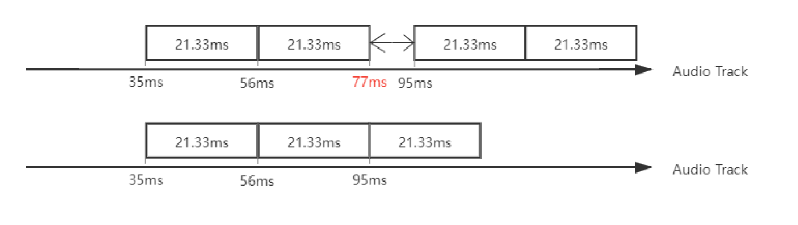

## 前端音视频经验之谈（一）

### 前言

本文以 FLV 为切入点，分享笔者在前端实时音视频方面遇到并解决过的一些问题；

笔者负责过的一些业务场景：

1. 常见直播业务
设备端使用 RTMP 协议推流 -> （云端）流媒体服务器 -> CDN 分发 -> 播放端拉 http-flv, hls, webrtc

2. Web 预览相机 RTSP 流
相机 RTSP -> 流媒体（格式）转换服务（将 RTSP 转为 http-flv） -> 播放端拉 http-flv

Web 前端在上述的场景中，主要是负责播放不同协议的流媒体资源；

### 如何尽可能稳定播放？

前端在刚开始接触实时音视频的时候，我们首先面临的核心问题应该是：“如何**稳定**的去播放？”

在 Web 上播放一个 MP4 视频时，我们一般是直接依赖 Html5 提供的能力，在整个播放过程中，浏览器本身会去请求数据，然后解码、渲染、播放，基本不需要开发者介入：

```html
<video src="https://demo.com/test.mp4" controls autoplay muted></video>
```

而在播放实时流（如 http-flv）时，前端就需要使用专门的播放器（如 `flv.js`, `mpegts.js`）：

```html
<script src="https://pro-cos-public.seewo.com/seewo-resources/statics/js/flvjs/1.7.12-rc.2/flv.min.js"></script>
<video id="videoEl"></video>

<script>
  if (flvjs.isSupported()) {
      const player = flvjs.createPlayer({
          isLive: true, // 直播
          type: 'flv',
          url: 'https://xxx.flv'
      });

      player.attachMediaElement(document.getElementById('videoEl'));
      player.load();
      player.play();
  }
</script>
```

在 `flv.js`, `mpegts.js` 这些库的实现中：

- flv 流的加载可以基于 [Fetch API](https://developer.mozilla.org/zh-CN/docs/Web/API/fetch) 实现
- 为了能让浏览器播放 flv 流，库开发者还需要将 flv 流 解封装 -> 转封装为 fMP4（只改变了流媒体资源的封装格式）
- 转封装后的 fMP4 流媒体数据，需要利用 [MSE API](https://developer.mozilla.org/zh-CN/docs/Web/API/Media_Source_Extensions_API) 塞进原生 `<video>`
- 最终由浏览器 `<video>` 完成对 fMP4 的解码、渲染、播放

在大多数时候，我们都是作为 `flv.js`, `mpegts.js` 这些库的使用方；

以直播业务为例，前端一般会得到一个 http-flv 流地址，然后使用 `flv.js` 来播放；

但这个过程并不会是一帆风顺的，在实际播放一个实时的 http-flv 时，前端可能会遇到以下情况：

1. 播放端刚开始播放的时候，http 请求一直在 pending

**前端可观察到的现象：**

Network 面板中的 fetch 请求一直在 pending，浏览器需要等待 10s+ 才会抛出超时/访问失败的错误

**前端实际可获得的信息**

浏览器超时后，fetch() 会抛一个错误，flv.js 会抛出一个错误事件

**造成此问题可能的原因：**

播放端无法访问流地址（如在公网播放内网的flv流）；

设备端未推流（播放端和流媒体服务建立了 TCP 连接，但一直没收到数据）；

**一些优化：**

在原有的 flv.js 实现中，通过 fetch() 请求 http-flv；当真的出现在公网播放内网的flv流的情况时，用户需要等待10s+才能得到响应；

为了提高用户体验，我们增加了一个 `xhrTimeout` 配置，由前端去指定超过多长时间没收到数据就抛出超时错误，提高响应速度；

2. http 响应返回了 404 等非 200 OK 的状态码

**前端可观察到的现象：**

http 请求能正常响应，但状态码错误

**前端实际可获得的信息**

flv.js 会判断状态码是否为 200，遇到异常错误码会抛出一个错误事件

**造成此问题可能的原因：**

设备端未推流；
设备端推流地址错误；
设备端无法访问流媒体服务；
流媒体服务异常；

3. 播放突然中断 - http 连接断开

**前端可观察到的现象：**

Network 面板中的 http 连接断开

**前端实际可获得的信息**

fetch() 会抛一个错误，flv.js 会抛出一个错误事件

**造成此问题可能的原因：**

播放端网络中断；
播放端网络发生了切换（wifi <-> 4G）；
设备端推流中断；
流媒体服务异常；

4. 播放突然中断 - http 连接正常

**前端可观察到的现象：**

Network 面板中的 http 连接正常

**前端实际可获得的信息**

`<video>` 抛出错误事件；
MSE 抛出错误，flv.js 会抛出一个错误事件；

**造成此问题可能的原因：**

流异常，浏览器无法兼容，解码失败；

<!-- | 现象 | 播放端可能导致问题的原因 |
| --- | --- |
| http 请求一直在 pending | 播放端无法访问流地址（如在公网播放内网的flv流）；<br>设备端未推流（播放端和流媒体服务建立了 TCP 连接，但一直没收到数据） |
| http 响应返回了 404 等非 200 OK 的状态码 | 设备端未推流；<br>设备端推流地址错误；<br>设备端无法访问流媒体服务；<br>流媒体服务异常； |
| 播放突然中断 | 播放端网络中断；<br>播放端网络发生了切换（wifi <-> 4G）；<br>流异常，浏览器无法兼容，解码失败； | -->


情况1、2一般发生在刚开始尝试拉流，情况3、4一般发生在拉流播放过程中；

前端在播放实时流时，在遇到上述 2、3、4 情况时，应该做到“尽可能重试”；

// TODO:

---

下面会介绍一些非网络因素引起的问题：

### 音画不同步的可能原因？


前置知识：

音频流由一帧一帧的音频帧（一段段的小音频）组成，根据音频的采样率和音频编码格式，可以算出音频帧的播放时长：
音频的采样率为 48000Hz，表示音频设备 1s 采集 48000 个样本；
音频以 AAC 编码，那么一个 aac 音频帧则会包含 1024 个样本，所以一个 aac 音频帧记录了 1024 * 1000 / 48000 = 21.33ms 的可播放音频；我们可以将 21.33ms 称为标准音频帧时长；

为了能让音频、视频有序且同步播放，一般每个音频帧、视频帧都会有各自的一个 DTS、PTS；
对于音频帧而言，一般是立即解码、立即播放的，所以它的 DTS 一般等于 PTS；

在理想情况下，音、视频的时间戳都应该是严格单调递增的；以上述 48000Hz AAC 音频为例，每一个音频帧应该以 21.33 ms 递增，考虑到时间戳一般以整数形式存储，音频帧以 21ms、22ms 来递增也是合理的；


遇到过一个问题：用户在 Web 观看 flv 直播流时，累计播放一段时间后，出现了音频快于视频画面的现象；在 VLC 上播放则不会出现这样的问题；



我们会发现，音频流的时间戳并不是严格递增的，某些音频帧之间的时间间隔大于 21.33ms；

对于这种音频存在Gap的情况，如果在 Chrome 浏览器中不做处理，直接塞给 `<video>` 播放，Chrome 会把后续的音频向前推进/播放，以便把Gap抹掉；

那么就会出现如下的情况，一帧应该在第95ms播放的音频被推进到第77ms播放；

由于音频帧的单位是毫秒级别，单单一两帧（少量）的音频帧并不会引起明显的音画不同步；

但如果此问题大量出现，那么随着播放时长的增加，声音快于视频的表现就会愈发明显；

这也就是为什么刚开始音画同步，播放一段时间后音画不同步。

解决方案：

flv.js 本身就有考虑到这种音频存在 Gap 的情况（最新版本默认开启配置 fixAudioTimestampGap: true），当发现 Gap >= 3 * 标准音频帧时长 时，flv.js 会主动填充静音帧，以保证音频帧按照时间戳播放。

### 卡顿的可能原因？

卡顿的现象：

1、画面在 loading

2、帧率不够，出现跳帧


### 如何正确使用 flv.js 实现低延迟？

网上给出的 flv 延迟数据一般在 2s，但在实际直播拉流时，延迟可能会到 4-6s，这可能是因为我们并没有正确使用 flv.js

#### 1、关闭 `enableWorker` worker 配置

开启 worker 会提高延迟

#### 2、关闭 `enableStashBuffer: false` 下载缓冲区配置

通过设置 `enableStashBuffer: false`，我们可以关闭 flv.js 的下载缓冲区；

一般来说，通过 `fetch` 请求到的流数据，会先存放在一个 **ArrayBuffer** 里面，等它满了才会塞进 `<video>` 播放；

关闭了下载缓冲区，请求到的流数据就会马上塞进 `<video>`，从而能降低该缓冲区带来的延迟；

风险：设立下载缓冲区是为了应对网络抖动（network jittering）的情况，关闭后可能会提高卡顿率

建议：纯内网情况下网络抖动的风险较低

#### 3、开启 `liveBufferLatencyChasing: true` 跳帧配置

除了 **ArrayBuffer** 这个下载用的缓冲区，`<video>` 本身也有自己的播放缓冲区，通过 `video.buffered` 可以查看当前缓冲了的范围；

通过设置 `liveBufferLatencyChasing: true`，我们可以开启跳帧功能；

在检测到播放缓冲区过大时，跳过一部分媒体流，直接播放较新的内容，从而缩小播放画面和最新流画面之间的延迟；
